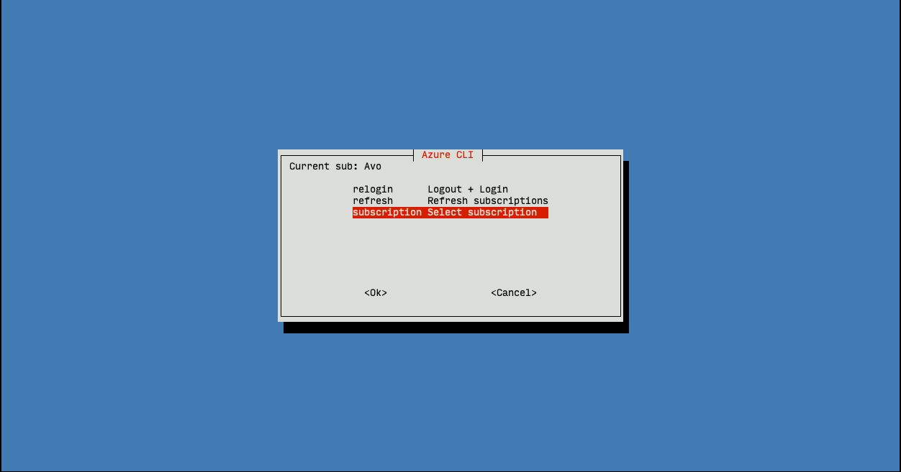

# azz

Small helper to deal with the verbosity of azure cli.

## Requirements

- yq
- azure cli

## Usage

On first execution the script will install itself to `/usr/local/bin/azz`.

After that it can be executed by typing `azz`.

# Features

- logout/login cycle
- refresh subscriptions
- change subscription
